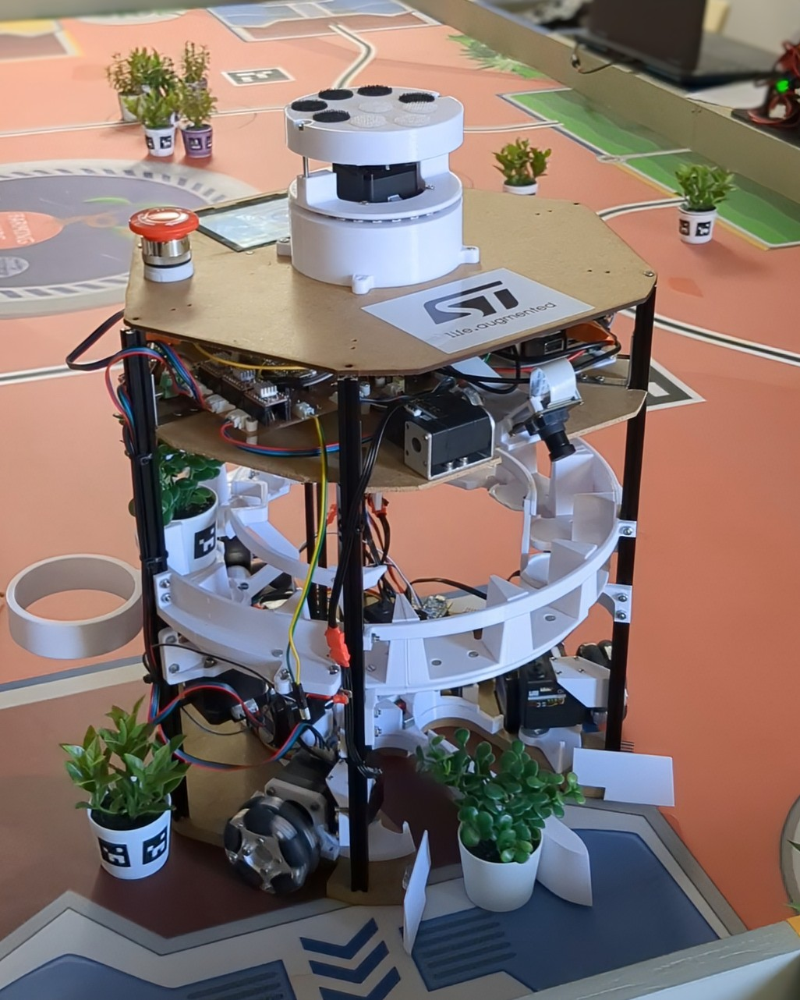
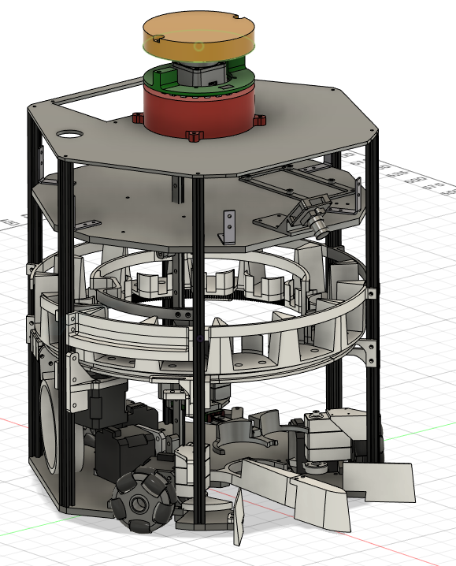
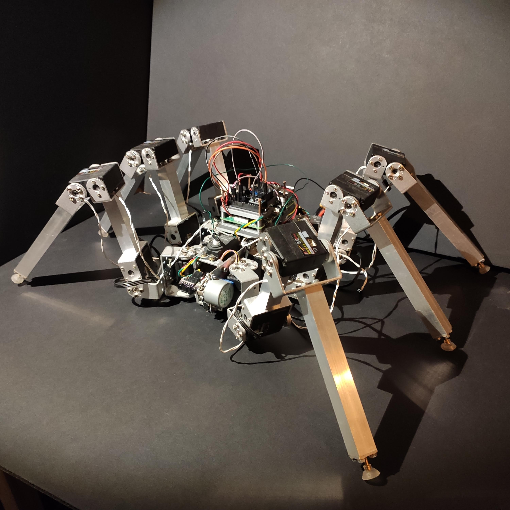
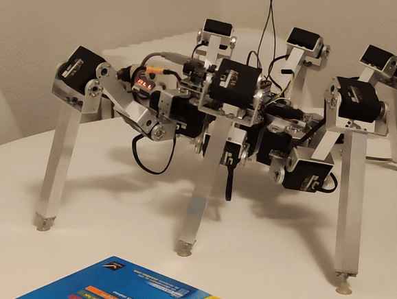
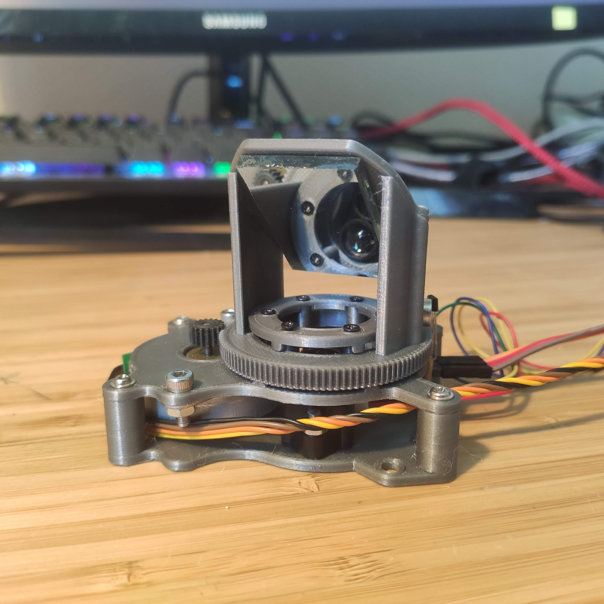
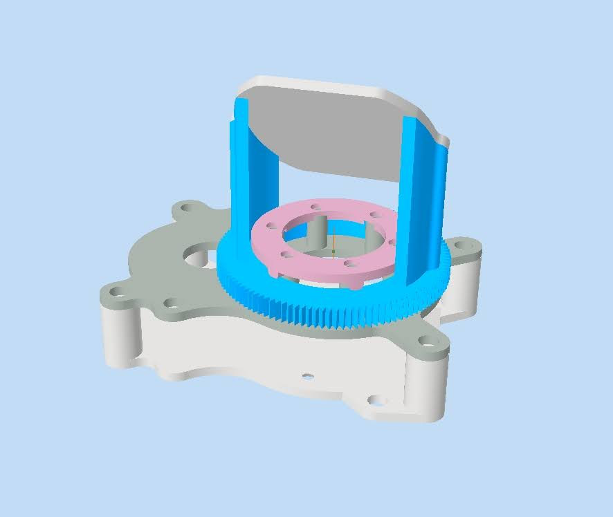
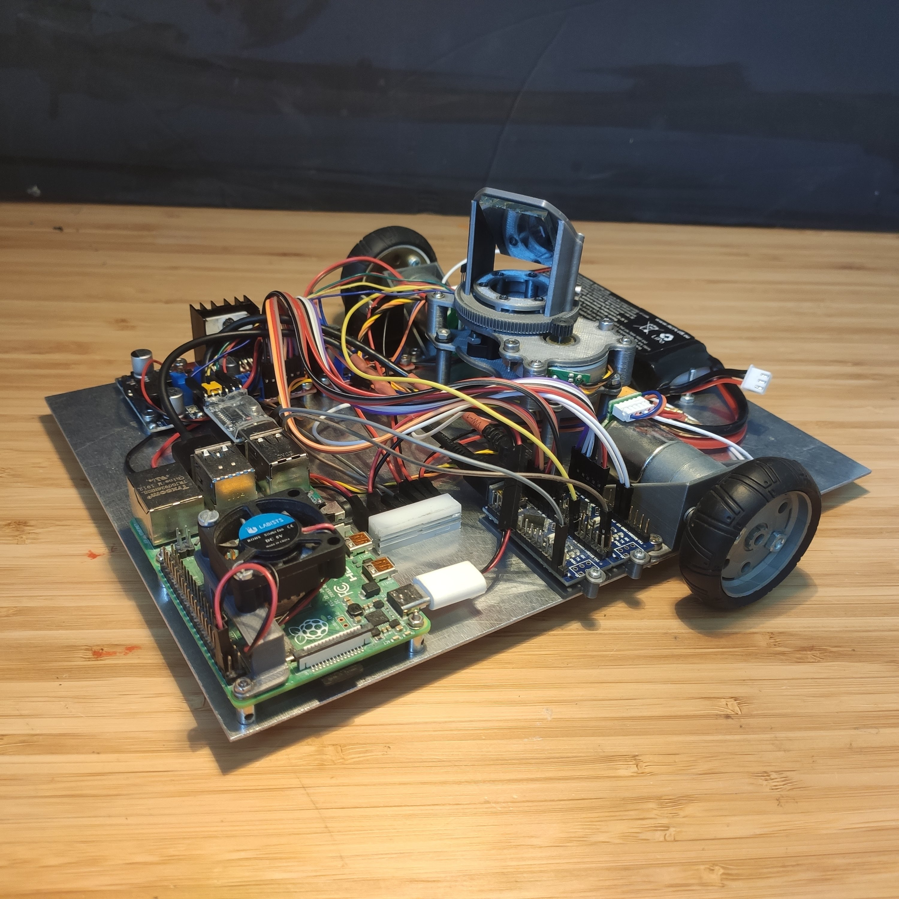
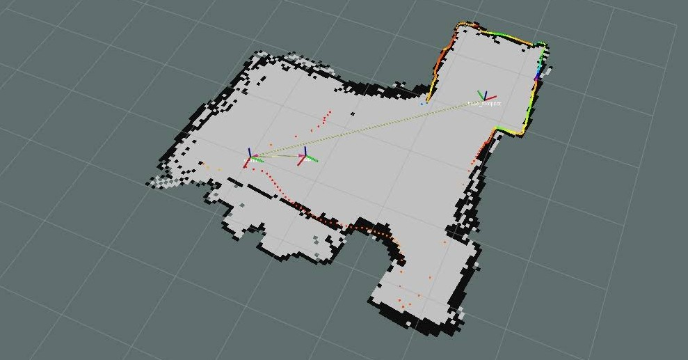

<h1 align="center">Hi! I'm André Russo</h1>
 
 
   

<h3 align="center">A passionate robotics / computer vision student!</h3>
<h3 align="center">Last year of Master in engineering (to be graduated in June 2025)</h3>

## I love robotics

I like to do **robotics projects**. Let me show you my favorite ones.

### Robot for Eurobot

| | | |
|:-------------------------:|:-------------------------:|:-------------------------:|
| | ||

### Hexapod Robot

| | |
|:-------------------------:|:-------------------------:|
| | |

### DIY ROS LiDAR

| | |
|:-------------------------:|:-------------------------:|
| | |

### Robot to learn ROS

| | |
|:-------------------------:|:-------------------------:|
| | |
